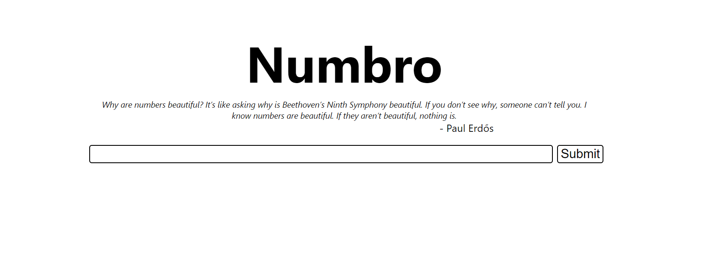

<h1 align="center">
    numbro
</h1>

> A website that shows you number properties
<div align="center">
    
</div>

numbro is a simple website made using reactjs that shows you
number theory properties of the number you want. The properties are
directly verified client side.

## Requirements
- [Node.js](https://nodejs.org/)
- [yarn](https://yarnpkg.com/)

## Install
```
git clone https://github.com/TrAyZeN/numbro.git
cd numbro
yarn install
```

## Usage
```
yarn start
```

## License
MIT TrAyZeN
